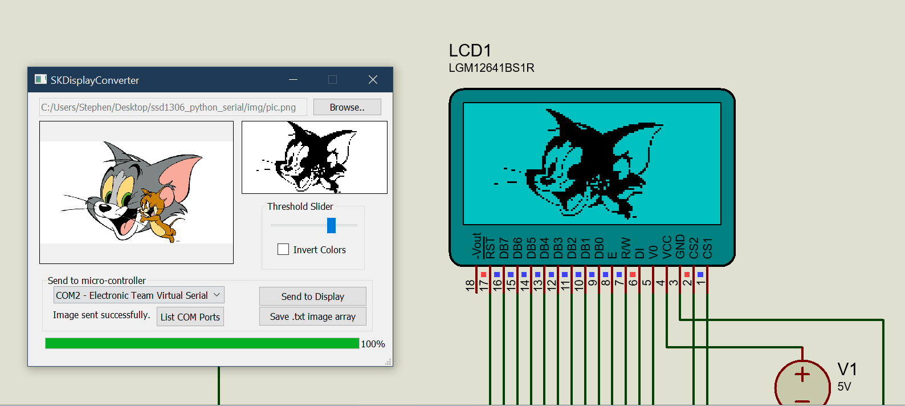
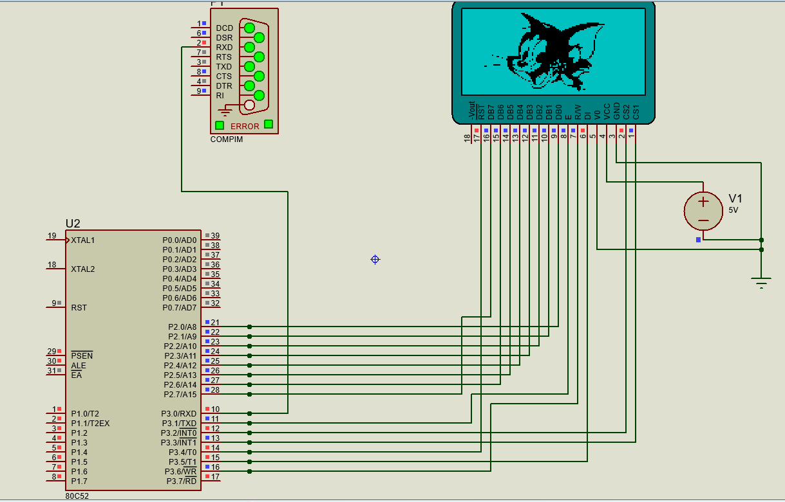

# 8051 microcontroller & 128×64 graphic LCD (SSD1306) with Python serial 

The 8051 microcontroller (Atmel 89S52) receives an image via a [USB to serial converter](img/CH340.jpg) from a computer and displays it on the LCD.

The Python script to help you do this is `SKDisplayConverter.pyw`. It affords a GUI interface to help you preprocess and send any .jpg or .png image to the microcontroller.



---

## Requirements

- Install [SDCC](http://sdcc.sourceforge.net/)

- Install [Python3](https://www.python.org/downloads/release/python-376/) and the following prerequistites
    - Requires PyQt5, pyserial libraries
        ```
        $ pip install PyQt5
        ```
        ```
        $ pip install pyserial
         ```

    - Alternatively, install Python prerequisties using:
        ```
        $ pip install -r  requirements.txt
        ```

---
# Usage
This section below gives you a summary on how to use the compile and use the C program and the Python script.

## C
- To compile the C program and generate the HEX file, you can use either Keil μVision or the command-line SDCC compiler.
    
    ##  SDCC
    - Open command prompt in the current directory and type:
        ```
        make
        ```
    > **Note:**
    The HEX file is generated in the bin folder.
    
    - To remove generated build files,  use:
        ```
        make clean
        ```
    ---
    ## Keil μVision

    Open the project file and use:
    ```
    Project -> Build Target 
    ```
    > **Note:**
    Ensure that the check box for       ```Create HEX File``` is enabled under ```Flash -> Configure Flash tools -> Output``` tab

    > Generated HEX file is stored by default in ```keil\Objects```

---
## Python
- The Python code for the GUI program can be run directly by double-clicking 
`SKDisplayConverter.pyw`. 

- Select any image using the application and send it to the microcontroller using the button `Send to Display`. Additional features on the application allow you to threshold pixels from 0 to 255 as to whether it is classified as black or white.

- You can also save the image as an array of characters in a .txt file if you wish to use it later in your own C program.

---

## Proteus Simulation

- Use the [Proteus](https://www.labcenter.com/simulation/) file to simulate what has been described without using actual hardware.

- Create virtual COM ports for communication between Python and the virtual microprocessor in Proteus using [Eltima virtual COM port driver](https://www.eltima.com/products/vspdxp/).

## Circuit
